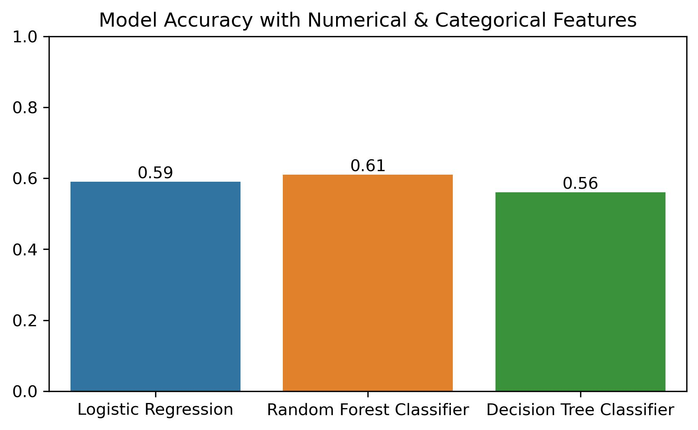
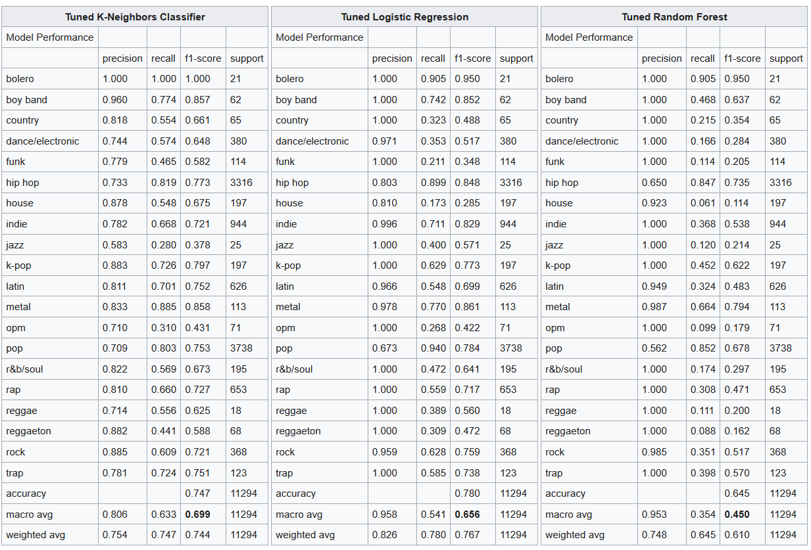
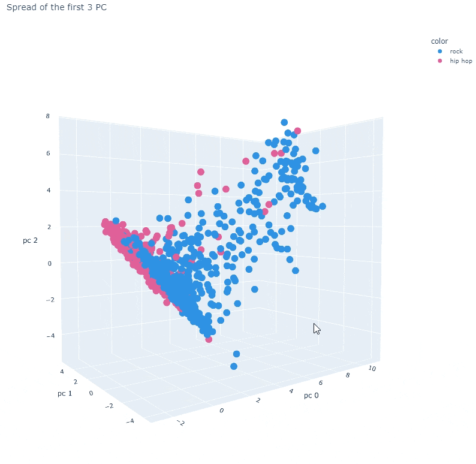
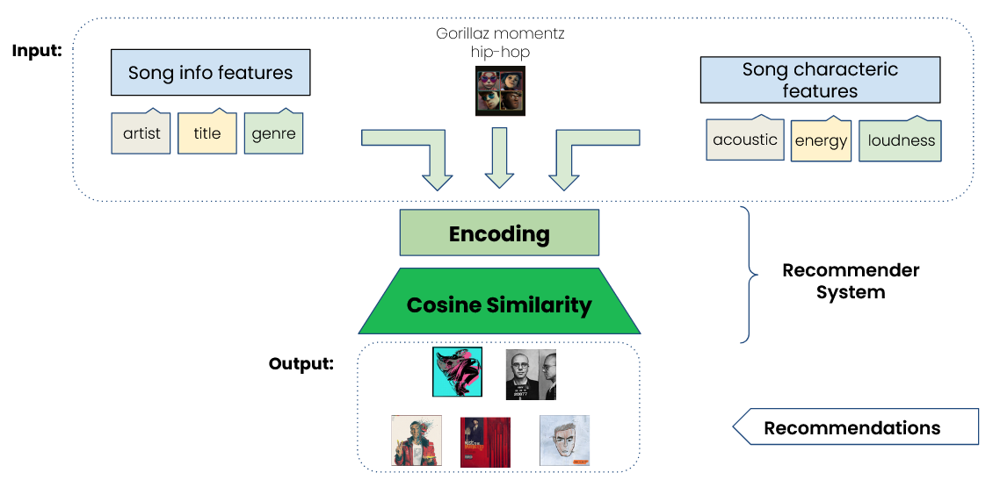
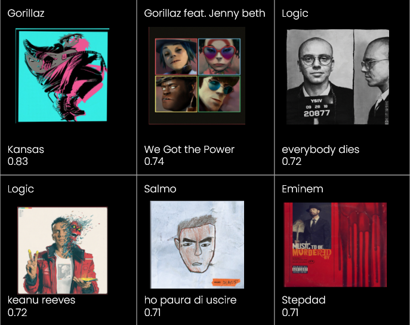

# spotify-data-science-project


A Data Science Projekt for a University Lab Course.

__Welcome to the Spotify Group page for the Data Mining Lab SoSe 2022__

Here we have taken a Spotify dataset and applying data mining techniques on it. Since Spotify is one of the largest platform for music, it also interesting from a business case perspective.

Take a look at our final pitch [here!](images/readme/Final.pdf)

## Topics Explored

### Popularity Analysis and Predictions

Final Results:



### Genre Clustering Visualization and Predictions

Final Results:

- Predictions
    

- Clustering Example PCA
    

### Recommender System of Songs

- Flowchart of the RS
    
- Specific Recommendations with similarity score
  - Input song: momentz by Gorillaz feat. De la Soul
    

## Structure of the Code

- Notebooks for EDA and first Modeling
- Sklearn Pipeline Setup for automated hyperparameter Tuning
  - Choose between gird or random search
  - Possibility for tuning multiple models at ones and choose best preforming one
  - PCA, Scaling & Outlier Cleaning as hyperparameters

### How to handle Conflicts for Notebooks when merging

```python
pip install nbdime
nbdime config-git --enable --global
```

Then if you have a merge conflicts, do:

```python
nbdime mergetool
```

This should allow you to use a gui to fix the conflics.
